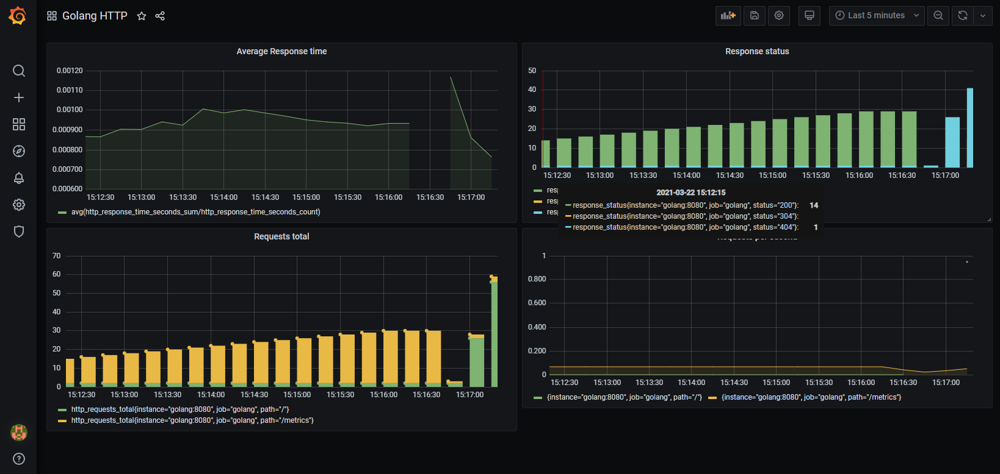

# Example Canary Deployment with Argo rollouts and Codefresh


This is an example Go application that exposes Prometheus metrics.
It is compiled using Codefresh.



Original code modified from https://gabrieltanner.org/blog/collecting-prometheus-metrics-in-golang

## How to build

Run:

 *  `go build` to get the executable OR
 *  `docker build . -t example-app` to create a container image if you prefer docker instead or don't have access to a Go dev environment

## How to run the application on its own

 * `go run .` OR
 * `docker run -p 8080:8080 example-app`

 Then visit http://localhost:8080 or http://localhost:8080/metrics

## To use with Argo Rollouts

To install the controller

```
kubectl create namespace argo-rollouts
kubectl apply -n argo-rollouts -f https://raw.githubusercontent.com/argoproj/argo-rollouts/stable/manifests/install.yaml
```

To create the first deployment

```
kubectl create ns canary
kubectl apply -f ./canary-manual-approval -n canary
```

To monitor the status

```
kubectl argo rollouts get rollout golang-sample-app-deployment --watch -n canary
```

To create a new color

```
kubectl argo rollouts set image golang-sample-app-deployment golang-sample-app-container=kostiscodefresh/argo-rollouts-canary-sample-app:9c7732e -n canary
```

To promote the color
```
kubectl argo rollouts promote canary-sample-app-deployment -n canary
```

To reject or undo the deployment

```
kubectl argo rollouts abort canary-sample-app-deployment -n canary
kubectl argo rollouts undo canary-sample-app-deployment -n canary
```

To get the IP and port of the preview service

```
kubectl get svc  rollout-canary-preview -n canary -o jsonpath='{.status.loadBalancer.ingress[0].ip}'
kubectl get svc  rollout-canary-preview -n canary -o jsonpath='{.spec.ports[0].port}'
```

## To use this project in Codefresh 


There is also a [codefresh.yaml](canary-manual-approval/codefresh.yaml) for easy usage with the [Codefresh](codefresh.io) CI/CD platform.


More details can be found in [Codefresh documentation](https://codefresh.io/docs/docs/ci-cd-guides/progressive-delivery/)

You can also import [graphana/graphana-dashboard.json](graphana/graphana-dashboard.json) as a premade dashboard


Enjoy!


